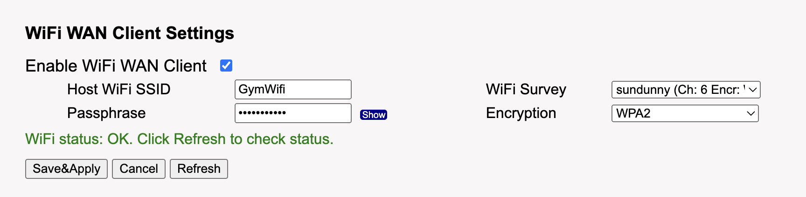
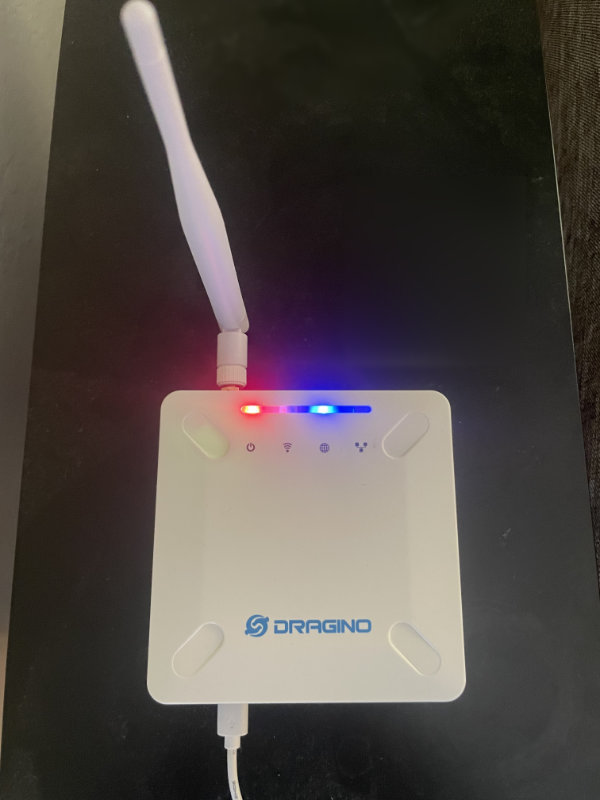

## Pebble Connect Gateways

Pebble Connect Gateways handle the incoming scans from all the scanners at the base of each climb. They are responsible for sending the data to the Pebble Connect Server.

### Setup

Plug in each gateway individually to a power source. After configuring each gateway, unplug it before plugging in the next gateway so you can make sure you're configuring the correct gateway.

### Configuration

1. Plugin a gateway to a power source.
2. Wait for a minute or two and then use a computer to connect to the "Pebble" wifi network. Use the password that was sent to you to connect.
3. Open a web browser and go to http://10.130.1.1/. For a user name and password, use "root" and the password you were sent to connect.
4. Hover on the "Network" tab and click on "Wifi".
5. Under "WiFi WAN Client Settings", either type in you WiFi name in the "Host WiFi SSID" field or find your WiFi name in the "WiFi survey" dropdown and click on it.
6. Type in your WiFi password in the "Passphrase" field.
7. Click on the "Save & Apply" button at the bottom of the page.
8. Wait for the gateway to reboot, reconnect to the "pebble" network with your computer, make sure the internet is working, and then unplug it from the power source.

### Placing your gateways in your gym

After you've setup your gateways, you will want to place them around the gym. The gateways use something called LoRa, short for long range wifi. So, the scanners should be able to connect from pretty far away. But, you also want to make sure that any one device can connect to multiple scanners as a failsafe since the technology isn't as robust as normal WiFi.

In addition, you want to make sure at least one gateway is close to where you will be charging the scanners. The gateways and scanners also have wifi capability that is used for downloading updates while the scanners are charging. So, whenever you plug in a scanner to charge, it will connect to the closest gateway and download any updates.

FYI, we don't use WiFi when the scanners transmit data because it requires more power and the LoRa allows greater range.

