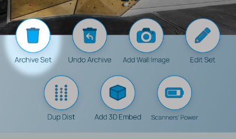
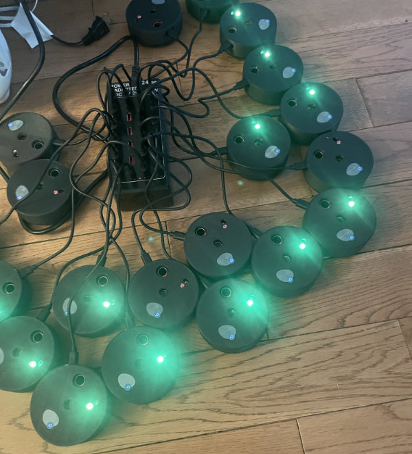

## Resetting an area that has scanners

Scanners are setup to trigger an error if the hole in the middle is blocked for too long and the scanner is connected to an active climb. **Because of this, you need to [archive the set](/routesetting/resetting-an-area) in an area before taking down the scanners.** This will prevent the scanner from triggering an error and sending notifications to all the head setters.

### Charging the scanners
After you have archived a set, take down the scanners and plug them into the charger. Make sure the charging station is close to at least one gateway. Scanners will flash a blue light while they check for an update, and then begin to recharge. The color of the LED indicates the level of charge. The closer the LED is to green, the more charge the scanner has. Once the scanner is fully charged, the LED will stop blinking.

## Setting a new area

To add scanners to a new area, follow the instructions in the [Adding a scanner to a climb](/scanners/adding-scanner) section.