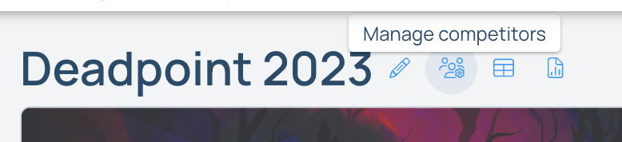

## Competition Feedback Surveys

After you've run a competition through Pebble, you can use the survey feature to get feedback from your participants. Below explains how to grab the user ids of your competitors in order to send them notifications for completing the survey.

1. Navigate to the "Manage Competitors" page for your competition on the website by going to your competition's page and click on the "Manage Competitors" icon beside the competition's name.

2. Click on the "Download List of Competitors" button on the top right of the page.

3. Open the downloaded file in Excel and copy all the ids in the "ID" column (not including the "ID" heading).

4. Navigate to your survey, open the "Participants" section, click the "An uploaded list of user IDs or emails", and paste the ids you copied into the textfield below.

5. Now, when you "Add a Notification" and send it out to the survey's users, the competitors will receive the notification.