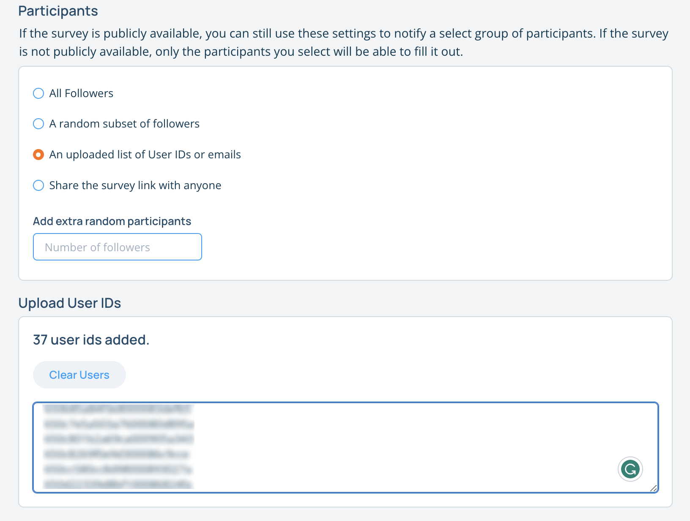

## Creating a Survey

You can create surveys to get feedback from your members. To create a survey, navigate to your gym's page on the website and click the "Create a Survey" button. 

### Survey Details

You need to give your survey a name, description, image, and optionally an expiration date. Additionally, you can define which gyms the survey is associated with if you manage more than one gym.

### Questions

You can add 3 different types of questions to your survey. Text questions that can be single or multiline, Multiple choice questions with a single answer, and multiple choice questions with multiple answers. With each multiple choice answer, you can also add a text box for the user to enter additional information.

#### Branching Questions

You can create survey questions that are only visible if the member answers a previous question in a certain way. To do this, create the question that may be hidden, and check the "Only show if a previous question is answered in a certain way."

### Participating Members

You can choose to send the survey out in a number of different ways. You can opt to make it public which will cause it to show up in the app on your gym's screen and on your gyms webpage. You can choose all your members or a subset of your members, or you can choose to make it available to anyone that you share the link with.

### Member IDs or Emails

If you choose to send the survey to a specific subset of your members using their member ids or emails, you can enter them in the text box below. Emails will only work if the email matches the email that the users used to sign up for their Pebble account. Therefore using emails is not recommended. Currently, unless you are one of Pebble's beta testers, the only way to use member ids is by downloading a list of competitors from a competition and copying the member ids from the list. You can view more information about that (here)[/surveys/competitors].

### Notifying participants

Pebble can notify participants in 2 ways: through push notifications to their phone or via email. In order to notify participants, make sure you have a group of participants defined for the survey, and then click the "Add a Notification" button. You will be prompted to choose whether you want to notify via push notifications or email. If you choose push notifications, you will be asked for a title, and, depending on the type of notification you want to send, a message and the content for the email. You can send a test push notification and test email to your own account so that you can test out the survey. 

